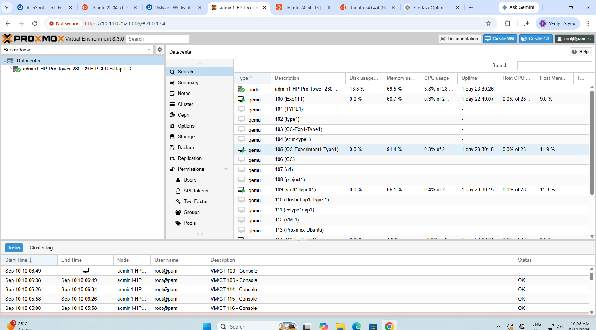
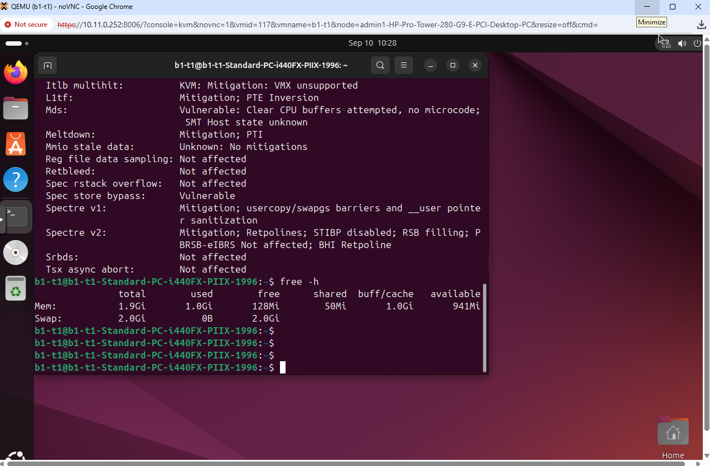
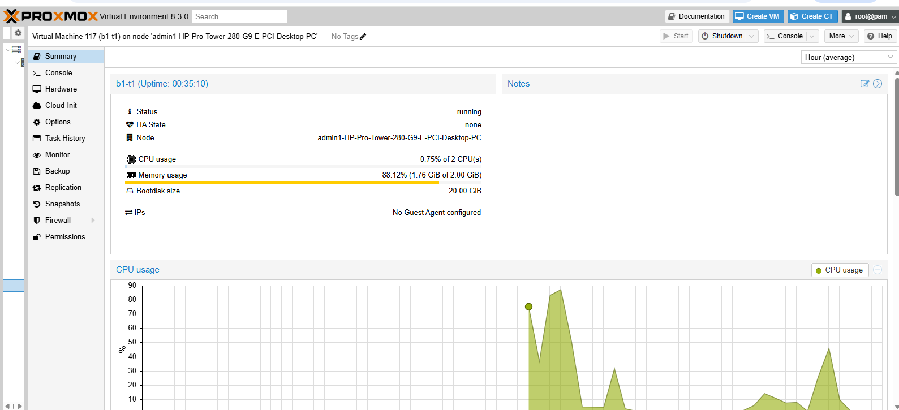
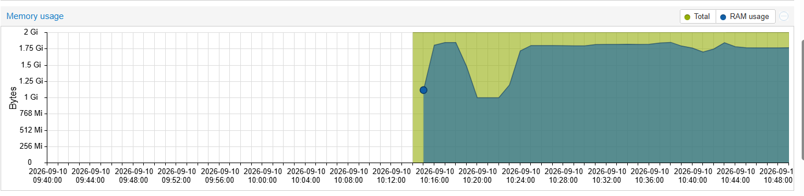
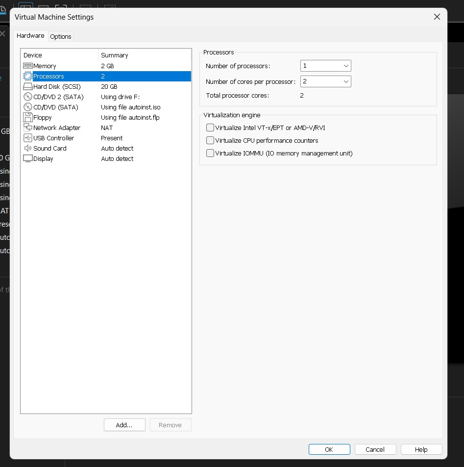
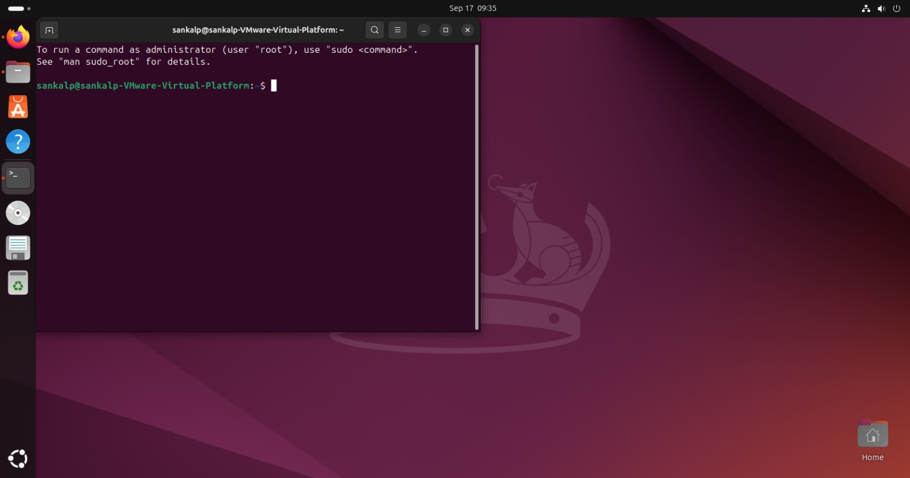
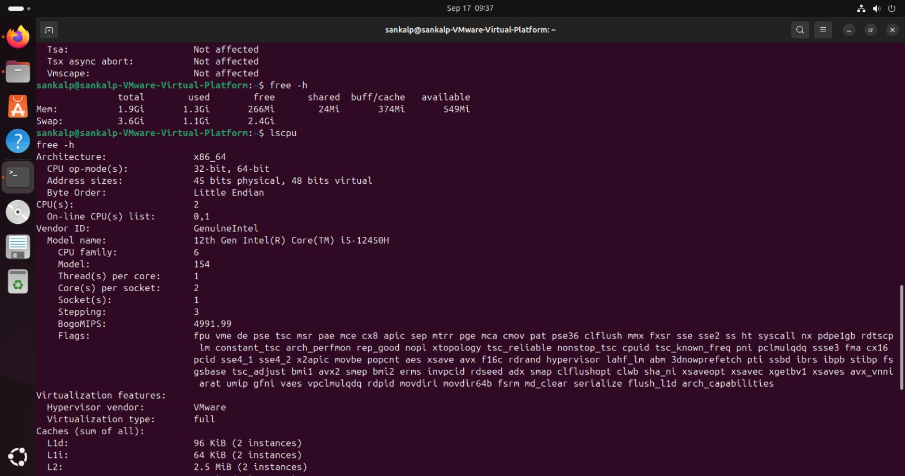
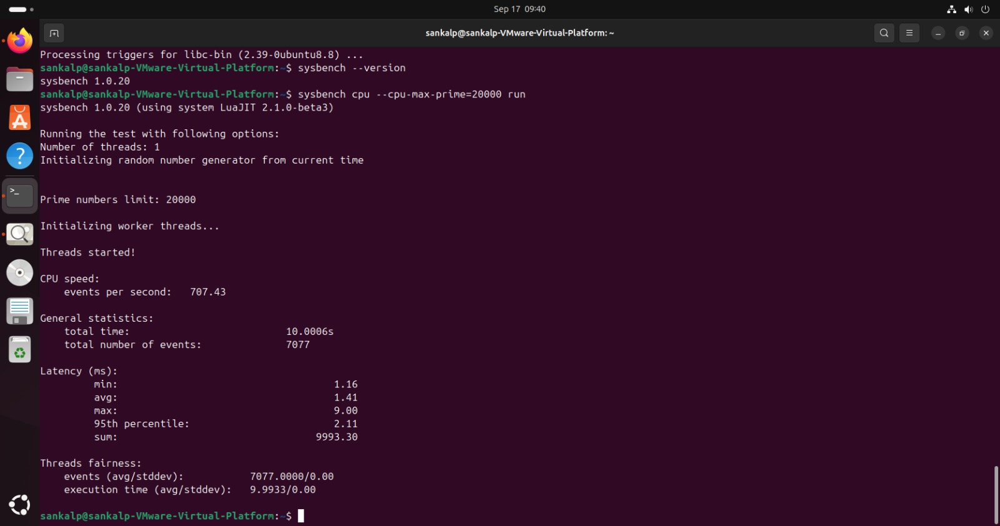
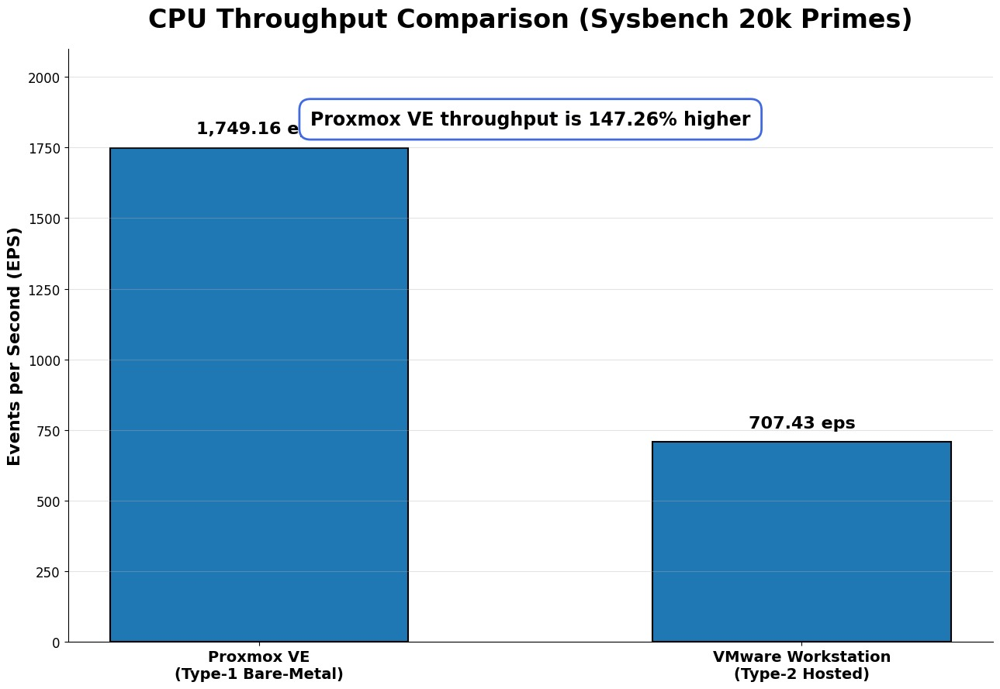
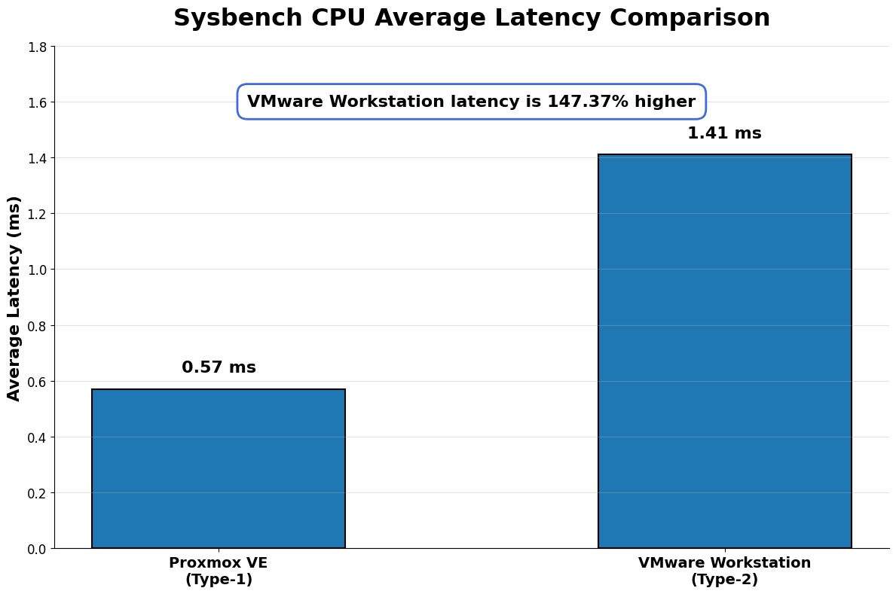

---

# Experimental Results

## Type-1 Hypervisor — Proxmox VE

The following screenshots document the Type-1 hypervisor experiment performed using Proxmox VE.

### Proxmox VE Dashboard

### Proxmox VM Configuration

### Proxmox VM Running

### Ubuntu Console

### System Configuration

### Sysbench Result

### Resource Monitoring

---

# Type-2 Hypervisor — VMware Workstation

The following screenshots document the Type-2 hypervisor experiment performed using VMware Workstation.

### VMware VM Configuration

### VMware VM Running

### VMware System Configuration

### VMware Sysbench Result

---

# CPU Performance Comparison

## CPU Throughput Comparison

The CPU throughput comparison between Proxmox VE and VMware Workstation is shown below.

### Recorded Throughput

| Hypervisor | Events Per Second |
|---|---:|
| Proxmox VE | 1749.16 EPS |
| VMware Workstation | 707.43 EPS |

---

## CPU Latency Comparison

The average CPU latency comparison between Proxmox VE and VMware Workstation is shown below.

### Recorded Latency

| Hypervisor | Average Latency |
|---|---:|
| Proxmox VE | 0.57 ms |
| VMware Workstation | 1.41 ms |

---

# Performance Summary

| Metric | Proxmox VE | VMware Workstation |
|---|---:|---:|
| CPU Throughput | 1749.16 EPS | 707.43 EPS |
| Average Latency | 0.57 ms | 1.41 ms |

---

# Result

The benchmark results obtained from the experiment are documented through the Proxmox VE and VMware Workstation screenshots and the CPU performance comparison graphs.

The throughput and latency measurements provide the basis for comparing the CPU performance of the virtual machines under the two hypervisor environments.

---

# Conclusion

The experiment demonstrates the practical process of configuring virtual machines under Type-1 and Type-2 hypervisors and evaluating their CPU performance using Sysbench.

The complete configuration screenshots, benchmark outputs, throughput comparison, and latency comparison are included above for reference.
